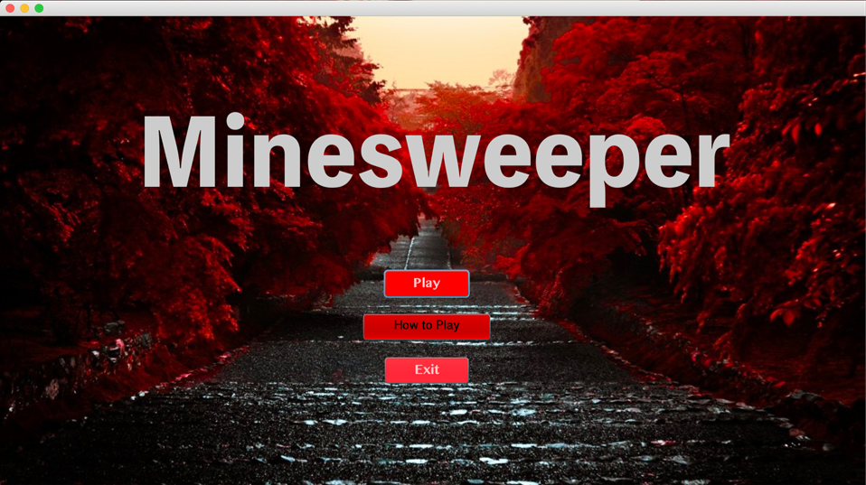
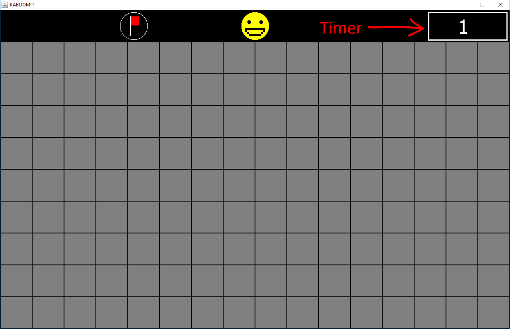
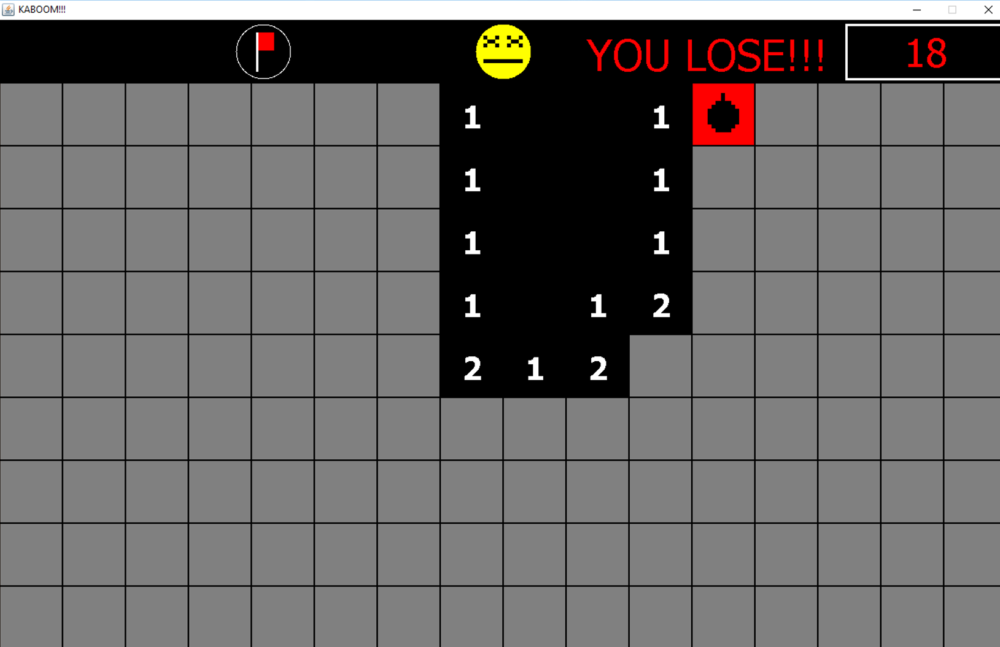
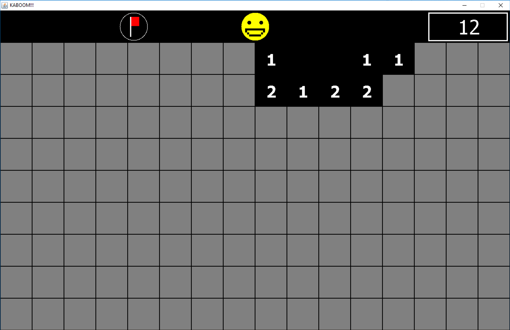
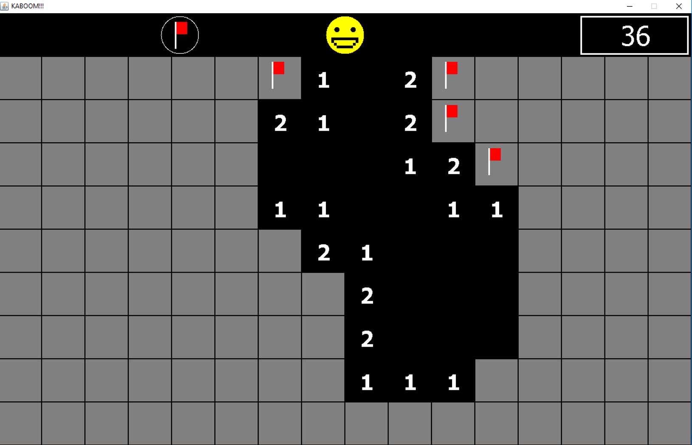

# Minesweeper

## Details of minesweeper
Minesweeper strategy is the art of solving games. Techniques include learning patterns and where to click first, using guessing tactics and developing efficient clicking and mouse movement.

## How to play?
1. Click **Play** button.

2. Play game by Left Click to select a square.

If there is a mine there, you lose the game.

If there is not a mine in that square, a number will appear in that location, and numbers in local neighbors of the selected square, except where there are mines.These numbers tell you how many mines are around a place.

You can click the flag to identify mines. If you completely clear the mines from all squares, you win.

## What does we learn and use in this project?
- Java Swing for Graphic User Interface (GUI), for example, using JFrame Form, create buttons.
- Using Object for mouse's moving, mouse click and create buttons .
- Using Inheritance for extend JFrame and JPanel.

## Contributors
- [**Hayato Kawai**](https://github.com/JP-SKE15) 6010545978
- [**Saowaphak Huayjaroen**](https://github.com/mookSaowaphak) 6010546729